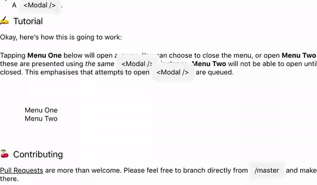

# @cawfree/react-native-modal-provider
A React &lt;Provider /> for managing &lt;Modal />s.

<p align="center">
  
</p>

## Contributing
[Pull requests](https://github.com/cawfree/react-native-modal-provider/pulls) and [Issues](https://github.com/cawfree/react-native-modal-provider/issues) are more than welcome! Feel free to branch directly from `/master`.

## 🚀 Getting Started

Using [`npm`]():

```sh
npm install --save @cawfree/react-native-modal-provider
```

Using [`yarn`]():

```sh
yarn add @cawfree/react-native-modal-provider
```

## 🤔 About
This is a utility function to ease the presentation of `<Modal />` content on [React Native](https://facebook.github.io/react-native/) and [React Native Web](https://github.com/necolas/react-native-web). It provides the following properties:

  - Works around web's the [`zIndex` presentation issue](https://github.com/necolas/react-native-web/issues/689), and ensures `<Modal />` content is always rendered top-most, under the provision the `<ModalProvider />` rests at the graphical content root of your app.
  - Enforces only a single `<Modal />` can be presented at a time.
  - Ensures sequential presentation of `<Modal/>`s, prioritized by which requested to become `visible` first.

## ✍️ Example

Using the `withModal` utility, you can turn arbitrary content into something that can be presented using the defined `ModalComponent`:

```javascript
import {
  Modal as SomeModalComponent,
} from 'react-native';
import { ModalProvider, withModal } from '@cawfree/react-native-modal-provider';

const ModalContent = ({ ...nextProps }) => (
  <View
    {...extraProps}
  />
);

const ConnectedModalContent = withModal(
  ModalContent,
);

const App = () => (
  <ModalProvider
    ModalComponent={SomeModalComponent}
  >
    <ConnectedModalContent
      visible
      style={{
        flex: 1,
        backgroundColor: 'green',
      }}
    />
  </ModalProvider>
);
```

You can run the example by heading into the [example directory](./RNModalProvider) and executing:

```sh
yarn # or npm install
npm run web
```

Then use your browser to navigate into your [local instance](localhost:3000).

## 🧰 Rolling Your Own
To define your own `ModalComponent` to render using the `ModalProvider`, all it expects is the `ModalComponent` accepts a `visible` prop, which is used to define whether the `Modal` is presented or not. There is a working example of how to do this in the [example directory](./RNModalProvider/).

There's an existing template based on using [react-native-material-menu](https://github.com/mxck/react-native-material-menu) as the `ModalComponent`.

## ✌️ License
[MIT](https://opensource.org/licenses/MIT)
